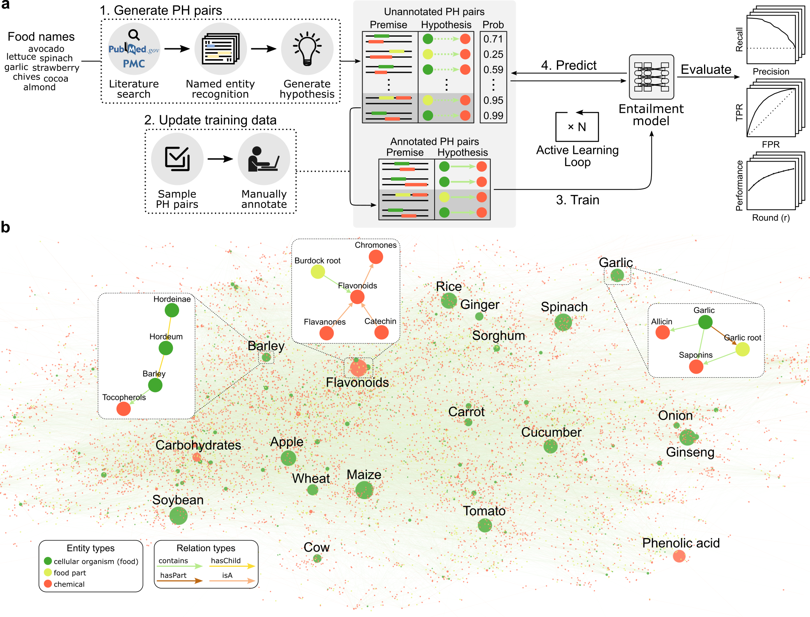
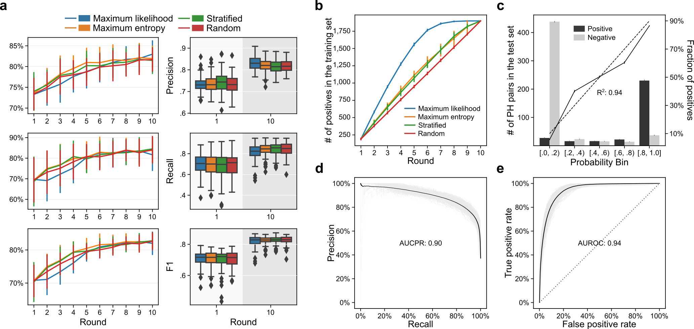
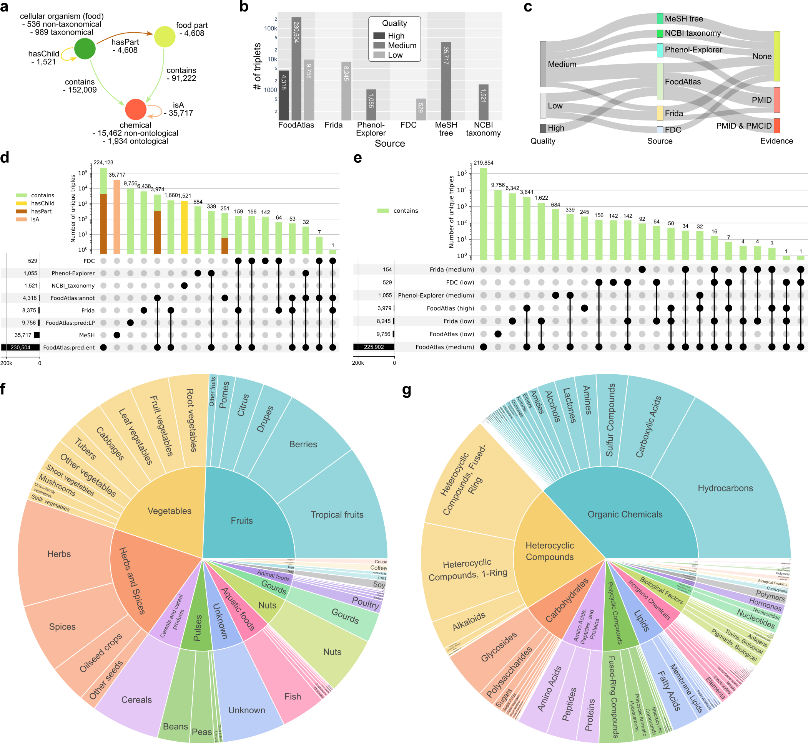
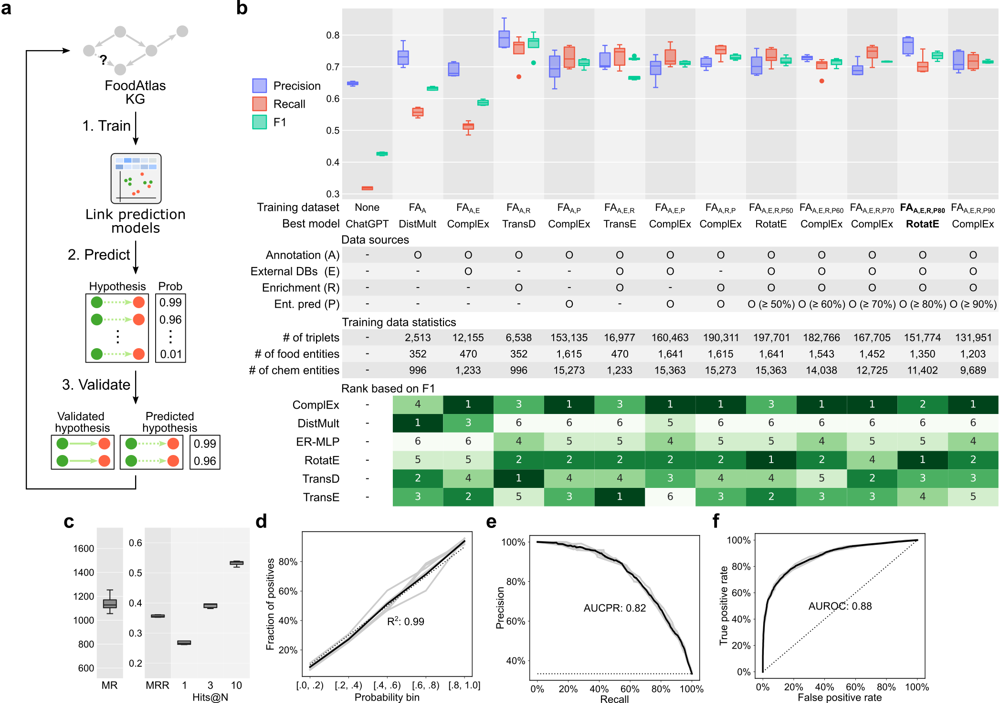

# FoodAtlas ([foodatlas.ai](https://www.foodatlas.ai/))

## Overview

### Introduction

Automated generation of knowledge graphs that accurately capture published infor-mation can help with knowledge organization and access, which have the potential to accelerate discovery and innovation. Here, we present an integrated pipeline to construct a large-scale knowledge graph using large language models in an active learning setting. We apply our pipeline to the association of raw food, ingredients, and chemicals, a domain that lacks such knowledge resources. By using an iterative active learning approach of 4,120 manually curated premise-hypothesis pairs as training data for ten consecutive cycles, the entailment model extracted 230,848 food-chemical composition relationships from 155,260 scientific papers, with 106,082 (46.0%) of them never been reported in any published database. To augment the knowledge incorporated in the knowledge graph, we further incorporated information from 5 external databases and ontology sources. We then applied a link prediction model to identify putative food-chemical relationships that were not part of the constructed knowledge graph. Validation of the 443 hypotheses generated by the link prediction model resulted in 355 new food-chemical relationships, while results show that the model score correlates well ($R^2$ = 0.70) with the probability of a novel finding. This work demonstrates how automated learning from literature at scale can accelerate discovery and support practical applications through reproducible, evidence-based capture of latent interactions of diverse entities, such as food and chemicals.

We are actively working on developing the [*FoodAtlas website*](https://www.foodatlas.ai/) where you can access all of our data.

*Figure 1. Overview of the FoodAtlas framework.*



* **a** Scientific literature is queried using raw food names and retrieved sentences (premises) where the species and chemical entities are tagged (e.g., … cocoa[SPECIES] is a good source of (-)-epicatechin[CHEMICAL] …). From these premises, hypothesis triplets are generated such as (cocoa, contains, (-)-epicatechin), which we refer to as premise-hypothesis (PH) pairs. The entailment model is then iteratively updated through active learning cycles, where a new batch of PH pairs is annotated in each cycle. Finally, both annotated and predicted positive PH pairs are used to populate the knowledge graph.
* **b** Visualization of the FoodAtlas Knowledge Graph (FAKG), which contains 285,077 triplets of 3 entity types and 4 relation types. Each triplet in the FAKG is assigned one of three quality types and provides a reference to the publications that support it for reproducibility.

### Results

*Figure 2. Prediction performance of the entailment model.*



* **a** Precision, recall, and F1 score of the entailment models trained using the 4 different AL strategies for initial (r = 1) and final (r = 10) rounds (n = 100, 100 different random seeds). On the left, the line plot shows the mean value of each AL strategy, and the error lines denote the standard deviation of the 100 random seeds. On the right, the box represents the interquartile range, the middle line represents the median, the whisker line extends from minimum to maximum values, and the diamond represents outliers.
* **b** Comparison of the new knowledge discovery rate compared between the 4 AL strategies. The plot shows how early on in the AL round the 1,899 positive triplets within the simulated training pool of 4,120 triplets are discovered. The error line shows the stand-ard deviation of the 100 random seeds.
* **c** Calibration plot showing a high correlation between the probability assigned by the entailment model and the ground-truth annotations on the test set ($R^2$ = 0.94).
* **d, e** The precision-recall and receiver operating characteristic curves of the entailment model predictions compared to the ground-truth annotations in the test set at the final round (r = 10) averaged over all 400 runs with a different random seed (100 runs for each of the 4 AL strategies).

*Figure 3. Statistics of the FoodAtlas Knowledge Graph.*



* **a** Schema of the FAKG. The relation types *contains*, *hasPart*, *isA*, and *hasChild* encode the food-chemical composition relations, the food-food with part relations, the chemical ontological relations using the MeSH tree, and the taxonomical relations using the NCBI Taxonomy, respectively.
* **b** Number of triplets per data source in the FAKG depending on the quality.
* **c** Sankey graph showing the connections between quality, data source, and evidence. The thickness of the relations between the nodes represents the number of connections in the log scale.
* **d, e** UpSet plot showing the number of unique triplets for all data sources for all relation types and all sources based on quality for only the contains triplets. Each row in the plot corresponds to a source, and the bar chart on the left shows the size of each source. Each column corresponds to an intersection, where the filled-in cells denote which source is part of an intersection. The bar chart for each column denotes the size of intersections. 'annot' stands for annotation, 'pred' stands for prediction, and 'LP' stands for link prediction.
* **f, g** Classification of foods and chemicals in FoodAtlas.

*Figure 4. Link prediction model performance.*



* **a** We use the FAKG to train a link prediction model whose objective is to generate hypotheses of type (food, contains, chemical) that is previously unknown in the graph.
* **b** Ablation study result showing the performance of 6 different link prediction models trained using 12 different versions of the FAKG, where different data sources were added or removed to understand their importance. While the training data is different for each version of the dataset, the validation and test set remain the same for fair comparison (positive to negative ratio is 1 to 2; baseline precision: 0.33, recall: 1.0, F1: 0.46). The best model for each dataset is selected based on the F1 score. The box represents the interquartile range, the middle line represents the median, the whisker line extends from minimum to maximum values, and the diamond represents outliers.
* **c** Standard rank-based metrics of the best model (RotatE) trained on the best training dataset ($FA_{A,E,R,P80}$). Lower is better for mean rank (MR), while higher is better for mean reciprocal rank (MRR), hits@1, hits@3, and hits@10.
* **d** Calibration plot showing a high correlation between the probability assigned by the link prediction model and the ground-truth annotations on the test set (n = 5, 5 different random seeds).
* **e, f** Preci-sion-recall and receiver operating characteristic curves of the best link prediction model.

## Prerequisites

This code has been tested with
* Python 3.8

To prevent dependency problems, please use either virtualenv...
```
# Activate Python virtualenv
python3 -mvenv env
source ./env/bin/activate

# Dectivate Python virtualenv
deactivate
```
or conda...
```
# Activate Conda environment
conda create -n mvenv python

# Deactivate Conda environment
conda deactivate
```

In your environment, please install python packages.
```
pip install -r requirement.txt
```

## Running

In order to reproduce the results obtained in our work, please follow the detailed steps below.

### Step 1. Download data
Download all input data first.
```
cd data
./download_and_process_data.sh
```

### Step 2. Generate the PH pairs and train/val/test set
Please follow the instructions in the [README](./food_atlas/data_processing/README.md) file.

### Step 3. Train the entailmnet model
Please follow the instructions in the [README](./food_atlas/entailment/README.md) file.

### Step 4. Generate the FoodAtlas KG
Run the script as below to generate the KG. The script was ran on a PC with 12 cores and 64 GB of RAM. Depending on your computer, you may want to adjust the `--nb_workers` argument to fit your needs. Please refer to the script for detailed steps.

```
cd ./food_atlas/data_processing
./kg.sh
```

### Step 5. Perform knowledge graph completion
Please follow the instructions in the [README](./food_atlas/kgc/README.md) file.

## Authors

* Jason Youn<sup>1,2,3</sup>
* Fangzhou Li<sup>1,2,3</sup>
* Gabriel Simmons<sup>1,2,3</sup>
* Shanghyeon Kim<sup>2,3</sup>
* Ilias Tagkopoulos<sup>1,2,3</sup>

1. Department of Computer Science, the University of California at Davis
2. Genome Center, the University of California at Davis
3. USDA/NSF AI Institute for Next Generation Food Systems (AIFS)

## Contact

For any questions, please contact us at tagkopouloslab@ucdavis.edu.

## Citation

Citation will be updated later.

## License

This project is licensed under the Apache-2.0 License. Please see the <code>[LICENSE](./LICENSE)</code> file for details.

## Acknowledgements
* Alexis Allot from National Center for Biotechnology Information (NCBI) for runninng LitSense queries internally.
* Kyle McKillop and Kai Blumberg from U.S. Department of Agriculture Agricultural Research Service (USDA ARS) for providing the FoodData Central (FDC) data internally.
* Anders Poulsen from Technical University of Denmark (DTU) for providing the Frida data internally.
* Navneet Rai and Adil Muhammad from the Tagkopoulos lab for annotating the PH pairs.
* Arielle Yoo from the Tagkopoulos lab for link prediction validation and analysis.

## Funding

* USDA-NIFA AI Institute for Next Generation Food Systems (AIFS), USDA-NIFA award number 2020-67021-32855.
